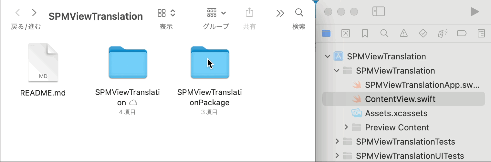

# SPMViewTranslation


## SPMマルチモジュール構成を採用

## 手順

### パッケージを生成 (1/4)

- [ ] パッケージ用のフォルダを作成 (`SPMViewTranslationPckage`)
- [ ] フォルダをパッケージ化

```.bash
$ cd ~~~~/SPMViewTranslation
$ ls
SPMViewTranslation.xcodeproj	SPMViewTranslationUITests
SPMViewTranslation		SPMViewTranslationTests
$
$ mkdir SPMViewTranslationPckage   // 名称は任意, 初期プロジェクト名とは被らないよう注意
$ cd SPMViewTranslationPckage
$ swift package init   // パッケージ化
Creating library package: SPMViewTranslationPackage
Creating Package.swift
Creating .gitignore
Creating Sources/
Creating Sources/SPMViewTranslationPackage/SPMViewTranslationPackage.swift
Creating Tests/
Creating Tests/SPMViewTranslationPackageTests/
Creating Tests/SPMViewTranslationPackageTests/SPMViewTranslationPackageTests.swift
$
$ ls
Package.swift	Sources		Tests
```

:::note warn
SPMを初期化する際のディレクトリは、SPMViewTranslation と名称を被らせないようにする必要があります。
今回は ディレクトリを `SPMViewTranslationPckage` (= SPMViewTranslation + Package) という名称にしています。
SPMViewTranslation と名称が被った場合、パッケージとして読み込んでくれません。注意してください。
:::

`ディレクトリ構造`確認
```console.bash
$ cd ~~~~/SPMViewTranslation
$ tree -L 2   // brew で tree をインストールする必要がある
├── README.md
├── SPMViewTranslation
│   ├── SPMViewTranslation
│   ├── SPMViewTranslation.xcodeproj
│   ├── SPMViewTranslationTests
│   └── SPMViewTranslationUITests
└── SPMViewTranslationPackage
    ├── Package.swift
    ├── Sources
    └── Tests
```

### マルチモジュール化 (2/4)

- [ ] `SPMViewTranslation.xcodeproj` を開き、GIFのように (Package.swiftの親ディレクトリである)`SPMViewTranslationPackage` を .xcodeproj へ追加する。


```.bash
$ cd ~~~~/SPMViewTranslation
$ open SPMViewTranslation/SPMViewTranslation.xcodeproj
```




### パッケージの整理 (3/4)

- [ ] `不要なフォルダ`を削除
Sources/SPMViewTranslationPackage
Tests/SPMViewTranslationPackageTests

```.bash
$ cd ~~~~/SPMViewTranslationPackage   // Package です
$
$ ls Sources
SPMViewTranslationPackage
$ rm -rf Sources/SPMViewTranslationPackage
$ 
$ ls Tests
SPMViewTranslationPackageTests
$ rm -rf Tests/SPMViewTranslationPackageTests
```

- [ ] フォルダの削除に合わせて、Package.swift を変更

```Package.swift
import PackageDescription

let package = Package(
    name: "SPMViewTranslationPackage",
    products: [
    ],
    dependencies: [
    ],
    targets: [
    ]
)
```


### モジュールの追加 (4/4)

- [ ] Source 配下に Featureフォルダを作成

- [ ] Featureフォルダに FirstView.swift を追加

Package.swift を以下のように設定

```diff
import PackageDescription

let package = Package(
    name: "SPMViewTranslationPackage",
+   platforms: [.iOS(.v17)],   // プロジェクトによって異なる
    products: [
+       .library(name: "Feature", targets: ["Feature"])
    ],
    dependencies: [
    ],
    targets: [
+       .target(name: "Feature")
    ]
)
```

```FirstView.swift
import SwiftUI

struct FirstView: View {
    var body: some View {
        Text("First View!")
    }
}

#Preview {
    FirstView()
}
```

**良いSPMマルチモジュールライフを！**


### 参考

https://zenn.dev/kalupas226/articles/73118709e316ad


